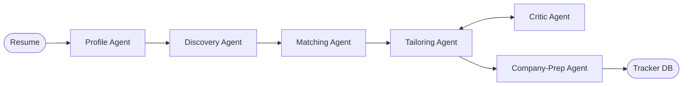

<div align="center">
  <h1>🎯 AI Job-Hunt Agent</h1>
  <p><b>Your personal, autonomous agent for intelligent job hunting.</b></p>
  <p>Reads your resume, discovers real jobs, ranks them, tailors your application, and preps you for the interview—all while strictly refusing to invent skills you don't have.</p>

  [](https://www.python.org/)
  [](https://fastapi.tiangolo.com/)
  [](https://langchain-ai.github.io/langgraph/)
  [](https://docs.litellm.ai/)
  [](https://www.docker.com/)

  [Quickstart](#-quickstart) • [Features](#-key-features) • [Architecture](#-architecture) • [Blueprint](docs/BLUEPRINT.md)
</div>

---

## ✨ Key Features

- 🧠 **Smart Matching**: Uses local embeddings (Sentence-Transformers) to score jobs against your resume with plain-language explanations.
- ✍️ **Honest Tailoring**: Rewrites your resume & cover letter for a specific job *without* fabricating skills, enforced by an AI Critic.
- 🎙️ **Interview Prep**: Researches the company live and generates customized Q&A and talking points.
- 📊 **Application Tracking**: Built-in SQLite tracker to manage your pipeline from `saved` to `offer`.
- 🔌 **Zero-Key Default**: Runs 100% locally on your CPU with fallback heuristics out-of-the-box. Upgrade with OpenAI/Gemini/Ollama keys when ready.

---

## ⚡ Quickstart

Get up and running in under 60 seconds.

```bash
git clone https://github.com/soorya-7007/job-hunt-agent.git
cd job-hunt-agent
python -m venv .venv && source .venv/bin/activate  # Windows: .venv\Scripts\activate
pip install -r requirements.txt
uvicorn app.main:app --port 8000
```
Then visit: [http://localhost:8000](http://localhost:8000)

<details>
<summary><b>🛠 Configuration (Optional API Keys)</b></summary>
<br>

To unlock the full power of the LLMs and live job boards:
```bash
cp .env.example .env
```
Add your keys (OpenAI, Gemini, or local Ollama) in the `.env` file. See `app/config.py` for details.
</details>

---

## 🏗 Architecture

Powered by a **LangGraph** State Machine, orchestrating 6 specialist agents:



<details>
<summary><b>🤖 Meet the Agents</b></summary>

- **Profile Agent**: Extracts structured data from your PDF resume.
- **Discovery Agent**: Queries job boards (Adzuna) based on your skills.
- **Matching Agent**: Ranks postings using vector embeddings.
- **Tailoring Agent**: Drafts your customized resume and cover letter.
- **Critic Agent**: Audits drafts against your original resume to prevent hallucination.
- **Company-Prep Agent**: Searches the web to prepare interview materials.
- **Tracker Agent**: Manages state in SQLite.
- **Chat & Autofill Agents**: Conversational UI and form-filling experiments.
</details>

---

## 🛠 Tech Stack

| Technology | Category | Purpose & How it's Used |
|---|---|---|
| **Python 3.10+** | Language | Core programming language driving all agent logic and backend services. |
| **LangGraph** | Orchestration | Coordinates the 6 specialist agents using a `StateGraph` with human-in-the-loop approval gates. |
| **FastAPI** | Backend | Serves the REST API endpoints and hosts the web frontend asynchronously. |
| **LiteLLM** | AI/ML | Provider-agnostic LLM routing (easily swap between OpenAI, Gemini, and local Ollama models). |
| **Sentence-Transformers** | AI/ML | Local text embeddings (`all-MiniLM-L6-v2`) used to compute cosine similarity for job ranking. |
| **SQLite & SQLAlchemy** | Database | Persists candidate profiles and tracks application lifecycle states (Saved → Applied → Offer). |
| **Streamlit & HTML/JS** | Frontend | Streamlit for visualizing agent internals; HTML/JS for the polished user-facing dashboard. |
| **DuckDuckGo Search** | Tooling | Live web research used by the Company-Prep agent to generate interview talking points. |
| **Docker & Pytest** | DevOps | Docker for reproducible containerized deployments; Pytest for adversarial guardrail testing. |

---

## 🛡 Responsible AI

1. **No Hallucinations**: A deterministic skill-checker and LLM critic ensure no skills are invented.
2. **Local First**: Resume parsing and vector embeddings run entirely on-device.
3. **Human-in-the-Loop**: The agent drafts, but *you* must approve before anything is saved or applied.

---

## 🚀 Deployment & Ways to Run

Run the FastAPI backend + web UI:
```bash
uvicorn app.main:app --port 8000
```

Run the Streamlit interactive demo:
```bash
streamlit run ui/streamlit_app.py
```

Run via Docker:
```bash
docker build -t job-hunt-agent .
docker run -p 8000:8000 --env-file .env job-hunt-agent
```

---

## 📄 License & Contact

**MIT License** © 2026 [sooryansh](https://github.com/soorya-7007)

Built as a portfolio project demonstrating multi-agent systems, AI guardrails, and production-ready GenAI engineering.

> ⭐ If you find this project useful, a star on GitHub is highly appreciated!
