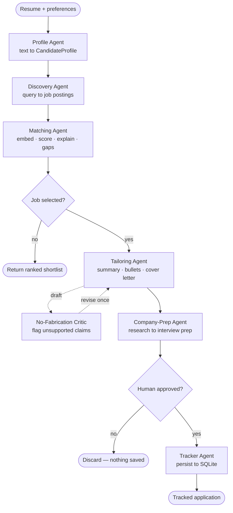

<div align="center">

# 🎯 AI Job-Hunt Agent

**A supervisor-led multi-agent system that reads your resume, finds real job postings, ranks them with explained scores, rewrites your resume for the one you pick — and refuses to invent a single skill you don't have.**

[](https://www.python.org/)
[](https://fastapi.tiangolo.com/)
[](https://langchain-ai.github.io/langgraph/)
[](https://docs.litellm.ai/)
[](https://www.sbert.net/)
[](https://www.sqlalchemy.org/)
[](https://modelcontextprotocol.io/)
[](https://www.docker.com/)
[](tests/)
[](LICENSE)

[Quickstart](#-run-it-in-60-seconds-no-api-keys) · [Architecture](#-architecture) · [Agents](#-the-agent-roster) · [Tech stack](#-tech-stack) · [API](#-rest-api) · [Skills](#-skills-demonstrated) · [Blueprint](docs/BLUEPRINT.md)

</div>

<!-- 📸 DEMO ASSET SLOT — add a GIF here and this README goes from good to great:
     1) uvicorn app.main:app --port 8000
     2) record ~20s: paste resume → ranked matches → tailor → critic verdict → track
     3) save as docs/demo.gif, then uncomment the line below
-->
<!-- <p align="center"></p> -->

---

## TL;DR

- **The problem.** Job seekers scroll hundreds of near-identical postings, send the same generic resume to all of them, and walk into interviews knowing nothing about the company.
- **What this does.** Six specialist AI agents, coordinated by a LangGraph state machine, turn a raw resume PDF into a ranked shortlist with reasoning, an honestly-tailored resume and cover letter, a grounded interview prep sheet, and a tracked application pipeline in SQLite.
- **Why it's technically interesting.** It is a *self-correcting* writer: the tailoring agent drafts, a separate critic re-reads the draft against the original resume, flags anything unsupported, and forces one rewrite. And the whole system runs **offline with zero API keys**, then upgrades itself when keys appear.

---

## ⚡ Run it in 60 seconds (no API keys)

```bash
git clone https://github.com/soorya-7007/job-hunt-agent.git && cd job-hunt-agent
python -m venv .venv && source .venv/bin/activate    # Windows: .venv\Scripts\activate
pip install -r requirements.txt
uvicorn app.main:app --port 8000                     # → http://localhost:8000
```

No keys, no signup, no credit card. Resume parsing falls back to a keyword heuristic, job
discovery falls back to `data/sample_jobs.json`, and embeddings run locally on your CPU.
Add keys later and the same code path gets smarter — see [Configuration](#-configuration).

---

## 🧭 What it does

| Capability | What actually happens | Where it lives |
|---|---|---|
| **Resume → structured profile** | PDF text extraction, then LLM structured extraction into a validated Pydantic model (heuristic keyword fallback with no key) | `app/tools/resume_parser.py`, `app/agents/profile_agent.py` |
| **Job discovery** | Builds a search query from the profile and calls the official Adzuna API; falls back to bundled sample postings | `app/agents/discovery_agent.py`, `app/tools/job_boards.py` |
| **Semantic ranking + skill gaps** | Embeds profile and postings locally, scores 0–100 by cosine similarity, writes a plain-language reason per job and lists missing skills | `app/agents/matching_agent.py`, `app/tools/embeddings.py` |
| **Honest resume tailoring** | Rewrites the summary and bullets to mirror the job description's language using only what the resume already supports | `app/agents/tailoring_agent.py` |
| **No-fabrication critic** | Re-reads every draft against the original resume, flags unsupported claims, triggers one automatic rewrite | `app/agents/critic.py` |
| **Cover letter drafting** | Generates a per-job letter that passes through the same critic | `app/agents/tailoring_agent.py` |
| **Interview prep** | Researches the company via web search, then produces grounded Q&A, talking points, and questions to ask back | `app/agents/company_prep_agent.py`, `app/tools/search.py` |
| **Human approval gate** | Nothing is saved or acted on until you approve the tailored artifacts | `app/orchestrator/graph.py` |
| **Application tracker** | SQLite pipeline: `saved → tailored → applied → interview → offer → rejected`, plus pending-action detection | `app/agents/tracker_agent.py`, `app/tools/tracker.py` |
| **Skill-gap → learning path** | Turns the gaps found during matching into a personalized Markdown curriculum | `app/agents/learning_agent.py` |
| **Conversational search** | "Find me remote Python jobs" — a router→tool→reply loop that works even on small local models | `app/agents/chat_agent.py` |
| **MCP server** | Exposes `search_for_jobs` over the Model Context Protocol so Claude Desktop or Cursor can use this project as a tool | `app/mcp_server.py` |
| **Form auto-fill** *(experimental)* | Playwright fills name/email on an application page — and is hard-coded never to click Submit | `app/agents/autofill_agent.py` |

---

## 🏗 Architecture

Six agents, one shared state object, two human gates. The supervisor is a LangGraph
`StateGraph`, so routing is data-driven rather than a hard-coded call chain.



**Request path:** `Web UI / Streamlit → FastAPI (app/main.py) → pipeline.py → agents → tools → SQLite`

**Shared state.** Every node reads and writes one `JobHuntState` TypedDict (profile, jobs,
matches, selected job, tailored resume, cover letter, interview prep, approval status,
messages, errors). A state graph beats a chain of function calls here for three reasons:
routing decisions live in one place, the run can pause at a human gate and resume later,
and when something goes wrong there is a single object to inspect.

---

## 🤖 The agent roster

| Agent | Responsibility | Technique it demonstrates | File |
|---|---|---|---|
| **Profile** | Resume text + preferences → validated `CandidateProfile` | Structured output extraction with schema validation | `app/agents/profile_agent.py` |
| **Discovery** | Profile → search query → live postings | External API integration with graceful degradation | `app/agents/discovery_agent.py` |
| **Matching** | Score, explain, and rank every posting | Embedding retrieval + cosine ranking (RAG-style) | `app/agents/matching_agent.py` |
| **Tailoring** | Rewrite summary, bullets, cover letter for one job | Constrained generation under a hard no-invention rule | `app/agents/tailoring_agent.py` |
| **Critic** | Audit the draft against the source resume | Reflection / self-critique loop + deterministic guardrail | `app/agents/critic.py` |
| **Company-Prep** | Company research → interview Q&A and talking points | Grounded generation from retrieved web results | `app/agents/company_prep_agent.py` |
| **Tracker** | Persist applications and surface what's pending | Stateful lifecycle management over a relational store | `app/agents/tracker_agent.py` |
| **Chat** | Natural-language job search | Router → tool → reply (ReAct-style) tool selection | `app/agents/chat_agent.py` |
| **Learning** | Skill gaps → personalized curriculum | Task-specific prompt design | `app/agents/learning_agent.py` |
| **Autofill** *(experimental)* | Fill an application form, never submit it | Browser automation with a safety stop | `app/agents/autofill_agent.py` |

---

## 🛠 Tech stack

| Layer | Choice | Why this one |
|---|---|---|
| Language | **Python 3.10+** | Standard for the GenAI ecosystem |
| Orchestration | **LangGraph** `StateGraph` | Conditional routing and resumable human-in-the-loop gates that a plain function chain can't express |
| LLM access | **LiteLLM** | One code path runs on OpenAI `gpt-4o-mini`, Google Gemini, or a local Ollama model — no vendor lock-in, and development costs nothing |
| Retrieval | **sentence-transformers** (`all-MiniLM-L6-v2`) + **NumPy** cosine similarity | Runs locally and free; a hosted embedding API would add cost and a hard dependency for a feature that fits in ~90 MB |
| Validation | **Pydantic v2** | LLM output is untrusted input — every agent boundary is a typed, validated contract |
| Backend | **FastAPI** + Uvicorn | Async REST, automatic OpenAPI docs, serves the frontend from the same process |
| Persistence | **SQLite** via **SQLAlchemy** ORM | Real data modeling and cross-session state without running a database server |
| Job data | **Adzuna API** (official) | Legitimate, documented access — deliberately no scraping of boards that forbid it |
| Web search | **DuckDuckGo** (`ddgs`) | Company research with zero keys and no rate-limit paywall |
| Resume parsing | **pdfplumber** | Reliable text extraction from real-world resume PDFs |
| Observability | **LangSmith** (optional) | Per-step traces, token counts, and latency when debugging agent behavior |
| Interop | **MCP** (`mcp`) | Exposes this project's job search as a tool for any MCP client |
| Automation | **Playwright** | Headless form fill for the experimental autofill agent |
| Frontend | Custom HTML/CSS/JS (`frontend/`) + **Streamlit** (`ui/`) | A polished product UI plus a fast demo surface for the agent internals |
| Testing | **pytest** (22 tests) | Unit, integration, and adversarial guardrail coverage |
| Deployment | **Docker** | Reproducible single-command run on any machine |

---

## 🔌 REST API

FastAPI serves both the JSON API and the web frontend. Interactive docs at
`http://localhost:8000/docs` once running.

<details>
<summary><b>All endpoints</b> (click to expand)</summary>

| Method | Path | Purpose |
|---|---|---|
| `GET` | `/api/health` | Service health and which optional integrations are configured |
| `POST` | `/api/profile/parse` | Resume text + preferences → structured `CandidateProfile` |
| `POST` | `/api/profile/upload` | Upload a resume PDF and parse it in one call |
| `POST` | `/api/jobs/search` | Run Profile → Discovery → Matching, return ranked matches |
| `POST` | `/api/jobs/tailor` | Tailored resume + cover letter for one job, with the critic's verdict |
| `POST` | `/api/jobs/prep` | Interview prep sheet for one job |
| `POST` | `/api/jobs/apply` | Experimental Playwright autofill against an application URL |
| `POST` | `/api/jobs/learn` | Learning path for the skill gaps on one job |
| `POST` | `/api/chat` | Conversational job search |
| `GET` | `/api/tracker/dashboard` | Pipeline summary and pending actions |
| `GET` | `/api/tracker/applications` | List tracked applications |
| `POST` | `/api/tracker/applications` | Save an application |
| `PATCH` | `/api/tracker/applications/{id}/status` | Advance an application's lifecycle stage |
| `DELETE` | `/api/tracker/applications/{id}` | Remove an application |
| `GET` | `/` `/jobs` `/dashboard` `/profile` `/chat` | Served frontend pages |

</details>

---

## 💡 Engineering highlights

These are the decisions worth asking me about in an interview.

**A writer that checks its own work.**
An LLM asked to "tailor a resume" will quietly add skills the candidate doesn't have — the
single most dangerous failure mode in this domain, because it puts a lie in front of a
recruiter. The fix is a second agent: `tailoring_agent` drafts, `critic` re-reads the draft
against the original resume text, and any unsupported claim triggers one automatic rewrite.
The critic runs in two layers so it works with or without an API key — a deterministic skill
check that cannot be talked around, plus an optional LLM reviewer that catches invented
employers, projects, and metrics a keyword list would miss. *Trade-off:* the deterministic
layer can flag a legitimate synonym, so the critic's verdict is surfaced to the user rather
than silently enforced.

**Zero-key by default, better with keys.**
Every external dependency has a fallback: no LLM key → heuristic resume parsing and template
tailoring; no Adzuna key → bundled `data/sample_jobs.json`; no embedding download → cached
local model. A reviewer can clone this repo and see it work in one command, which matters more
for a portfolio project than any single feature. *Trade-off:* two code paths per agent to
maintain, which is why the fallbacks are deliberately simple and honest about being fallbacks.

**Provider-agnostic LLM layer.**
All model calls go through one thin module (`app/llm.py`) built on LiteLLM, so switching from
`gpt-4o-mini` to Gemini to a local `ollama/llama3.1` is a single environment variable. That
kept iteration free during development and means the project isn't stranded if one provider's
pricing or limits change.

**A state graph instead of a script.**
The first version was a linear pipeline. It broke the moment the flow needed to stop and wait
for a human decision, then resume. Rebuilding the supervisor as a LangGraph `StateGraph` with
two conditional edges made the pause points explicit and put all routing logic in one
readable place.

**Human-in-the-loop by design, not by omission.**
The system never submits an application. It drafts, explains, and waits. Even the experimental
Playwright agent is written so it fills fields and stops — it never locates or clicks a submit
button. This is a product decision as much as a safety one: the candidate stays accountable
for what goes out under their name.

---

## 🛡 Responsible AI

Constraints chosen before any code was written, each enforced somewhere you can point to:

| Constraint | How it's enforced |
|---|---|
| **Never invents skills or experience** | `app/agents/critic.py` — deterministic skill check + LLM reviewer, tested adversarially in `tests/test_guardrails.py` |
| **Official job-board APIs only, no scraping** | `app/tools/job_boards.py` uses the documented Adzuna API; no HTML scrapers exist in this repo |
| **Never auto-submits an application** | No submit path in `app/agents/autofill_agent.py`; approval gate in `app/orchestrator/graph.py` |
| **Resume data stays local** | Parsing and embeddings run on-device; only the text you send to your chosen LLM leaves the machine |
| **Secrets stay out of git** | Keys read from `.env` only; `.env` is gitignored and `.env.example` is the committed template |

---

## 🧪 Testing & evaluation

```bash
pytest -v                                # 22 tests: unit, integration, and adversarial
python -m app.evaluation.match_eval      # ranking precision on a labeled mock set
python -m app.evaluation.tailoring_eval  # does the tailor hallucinate under pressure?
```

**What the suite actually covers**

- `test_api.py` — health, static pages, profile parsing, job search, tailoring, prep, and the full tracker lifecycle through the FastAPI layer.
- `test_guardrails.py` — the adversarial case: the job demands React, the resume has none. The tailored output must not claim React.
- `test_phase2.py` — critic flags an unsupported skill, passes a grounded draft, avoids word-boundary false positives, never fabricates in heuristic mode, and round-trips the tracker DB.
- `test_phase3.py` — grounded company prep with and without a mocked LLM, search-tool fallback when offline, cover letter drafting, tracker summaries, and both LangGraph supervisor workflows end to end.
- `test_matching.py` — cosine similarity bounds and sample-data schema validity.

The suite is key-free by design: LLM calls are mocked or fall back, so it runs in CI without secrets.

---

## 🎓 Skills demonstrated

| Skill / keyword | Concrete evidence in this repo |
|---|---|
| **Agentic AI · multi-agent systems** | 10 single-responsibility agents under `app/agents/`, coordinated rather than chained |
| **Agent orchestration · LangGraph** | `app/orchestrator/graph.py` — `StateGraph`, 6 nodes, 2 conditional edges, typed shared state |
| **RAG · vector similarity search** | Local sentence-transformer embeddings + cosine ranking in `app/tools/embeddings.py` and `matching_agent.py` |
| **Prompt engineering** | Role-scoped system prompts per agent, with explicit constraint and format instructions |
| **Structured LLM output** | Pydantic v2 models in `app/schemas.py` validate every agent boundary |
| **Tool calling · ReAct routing** | `chat_agent.py` routes a natural-language message to `search_jobs`, then answers from the result |
| **Reflection · self-critique loops** | Draft → critique → revise cycle between `tailoring_agent.py` and `critic.py` |
| **Hallucination guardrails · AI safety** | Two-layer no-fabrication critic, verified by adversarial tests |
| **LLM evaluation** | `app/evaluation/` — ranking precision harness and a tailoring-fidelity check |
| **LLM observability** | Optional LangSmith tracing wired through `app/config.py` |
| **Human-in-the-loop design** | Two approval gates; no autonomous submission anywhere in the system |
| **Model routing · cost control** | LiteLLM abstraction supporting hosted and fully local models via one env var |
| **Model Context Protocol** | `app/mcp_server.py` publishes `search_for_jobs` over stdio to any MCP client |
| **REST API design** | 14 FastAPI endpoints, typed request/response models, CORS, static serving |
| **SQL · data modeling** | SQLAlchemy ORM over SQLite with a real lifecycle state machine |
| **Testing** | 22 pytest tests including adversarial safety cases, runnable without API keys |
| **Containerization · DevOps** | `Dockerfile` + `.dockerignore` for a one-command deploy |
| **Frontend integration** | Multi-page HTML/JS client plus a Streamlit app, both against the same API |
| **Web scraping ethics · API integration** | Official Adzuna API with a documented no-scraping policy |
| **Browser automation** | Playwright autofill with a deliberate safety stop |

---

## ⚙️ Configuration

Everything is optional. Copy the template and fill in only what you want.

```bash
cp .env.example .env
```

| Variable | What it unlocks | Where to get it |
|---|---|---|
| `OPENAI_API_KEY` + `LLM_MODEL` | LLM resume parsing, written match reasoning, real tailoring and prep | [platform.openai.com](https://platform.openai.com/api-keys) — `gpt-4o-mini` is very cheap |
| `LLM_MODEL=gemini/gemini-1.5-flash` + `GEMINI_API_KEY` | Same, on Google's free tier | [aistudio.google.com](https://aistudio.google.com/) |
| `LLM_MODEL=ollama/llama3.1` | Same, fully local and free — no key at all | `ollama pull llama3.1` |
| `ADZUNA_APP_ID` / `ADZUNA_APP_KEY` / `ADZUNA_COUNTRY` | Live job postings instead of bundled samples | [developer.adzuna.com](https://developer.adzuna.com/) — free tier |
| `LANGCHAIN_TRACING_V2` + `LANGCHAIN_API_KEY` | LangSmith traces of every agent step | [smith.langchain.com](https://smith.langchain.com/) — free tier |
| `EMBEDDING_MODEL` | Swap the local embedding model | Defaults to `all-MiniLM-L6-v2` |

> First run downloads the embedding model (~90 MB) once, then works offline.

---

## 🚀 Ways to run it

```bash
# 1. Full web app — recommended (FastAPI serves the API and the UI)
uvicorn app.main:app --port 8000
#    /          landing + search      /dashboard   application pipeline
#    /jobs      discovery + tailoring /profile     parsed candidate profile
#    /chat      conversational search /docs        interactive API docs

# 2. Streamlit demo — best view of the agent internals
streamlit run ui/streamlit_app.py
#    Tabs: Job Matches · Tracker & Dashboard · Multi-Agent Supervisor

# 3. MCP server — expose job search to Claude Desktop, Cursor, or any MCP client
python -m app.mcp_server

# 4. Docker — reproducible, no local Python setup
docker build -t job-hunt-agent .
docker run -p 8000:8000 --env-file .env job-hunt-agent
```

---

## 📁 Project layout

```
job-hunt-agent/
├── app/
│   ├── main.py                    # FastAPI app: REST endpoints + frontend serving
│   ├── pipeline.py                # high-level entrypoints (run, tailor_for_job, prep_for_job)
│   ├── config.py                  # env-driven settings + LangSmith flags
│   ├── schemas.py                 # Pydantic contracts shared by every agent
│   ├── llm.py                     # provider-agnostic chat + JSON helper (LiteLLM)
│   ├── mcp_server.py              # MCP server exposing search_for_jobs
│   ├── orchestrator/
│   │   └── graph.py               # LangGraph StateGraph: nodes, routing, human gates
│   ├── agents/
│   │   ├── profile_agent.py       # resume text → CandidateProfile
│   │   ├── discovery_agent.py     # profile → search query → postings
│   │   ├── matching_agent.py      # embed, score, explain, find gaps
│   │   ├── tailoring_agent.py     # tailored summary, bullets, cover letter
│   │   ├── critic.py              # no-fabrication guardrail (the reflection step)
│   │   ├── company_prep_agent.py  # company research → interview Q&A
│   │   ├── tracker_agent.py       # application lifecycle + pending actions
│   │   ├── chat_agent.py          # conversational job search
│   │   ├── learning_agent.py      # skill gaps → learning path
│   │   └── autofill_agent.py      # Playwright form fill (never submits)
│   ├── tools/
│   │   ├── resume_parser.py       # pdfplumber text extraction
│   │   ├── job_boards.py          # Adzuna API + sample fallback
│   │   ├── embeddings.py          # sentence-transformers + cosine similarity
│   │   ├── search.py              # DuckDuckGo company research
│   │   └── tracker.py             # SQLAlchemy models + SQLite persistence
│   └── evaluation/
│       ├── match_eval.py          # ranking precision on a labeled mock set
│       └── tailoring_eval.py      # tailoring fidelity / hallucination check
├── frontend/                      # multi-page web client (index, jobs, dashboard, profile, chat)
├── ui/streamlit_app.py            # Streamlit demo of the agent internals
├── data/sample_jobs.json          # lets the app run with zero API keys
├── tests/                         # 22 pytest tests (incl. adversarial guardrails)
├── docs/BLUEPRINT.md              # full architecture + phased build log
├── Dockerfile                     # container build
└── .env.example                   # every optional key, documented
```

---

## 📌 Scope, limitations, and what's next

Stated plainly, because a reviewer will find these anyway:

- **Single-user local app.** No authentication and permissive CORS, appropriate for something that runs on your own machine. Multi-user deployment would need auth, per-user data isolation, and a locked-down origin list.
- **Match scoring is embedding similarity, not a trained ranker.** It's fast, explainable, and free — but it doesn't learn from your outcomes yet.
- **One job board.** Adzuna only. More official APIs would improve coverage.
- **Autofill is a proof of concept.** Generic field names only, and intentionally incapable of submitting.
- **Evaluation is a small mock set.** The harness is real; the dataset is deliberately tiny and should grow.

**Roadmap:** hosted public demo · GitHub Actions CI on every push · larger labeled evaluation
set with tracked regression scores · additional job-board integrations · outcome feedback so
ranking improves from real application results.

<details>
<summary>Build history</summary>

| Phase | Delivered |
|---|---|
| **1** | Profile, Discovery, and Matching agents + Streamlit demo |
| **2** | Tailoring agent, no-fabrication critic, human approval gate, SQLite tracker |
| **3** | Company-Prep agent, LangGraph supervisor, LangSmith tracing, cover letters |
| **4** | Evaluation harness, adversarial guardrail tests, Docker |
| **5** | FastAPI backend, multi-page web frontend, chat agent, learning paths, MCP server, Playwright autofill |

Full design rationale in [`docs/BLUEPRINT.md`](docs/BLUEPRINT.md).

</details>

---

## 📄 License

[MIT](LICENSE) © 2026 sooryansh — use it, fork it, learn from it.

## 👤 Author

**sooryansh** — [@soorya-7007](https://github.com/soorya-7007)

Built as a portfolio project for **GenAI / LLM Engineer** roles. If the no-fabrication critic
or the LangGraph supervisor is the kind of problem your team works on, I'd like to talk.

<!-- Fill these in:
- LinkedIn: https://linkedin.com/in/YOUR-HANDLE
- Email: your.email@example.com
-->

<div align="center">

If this was useful or interesting, a ⭐ helps more people find it.

</div>
